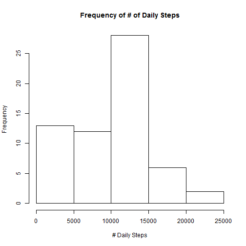
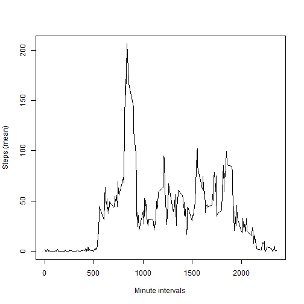
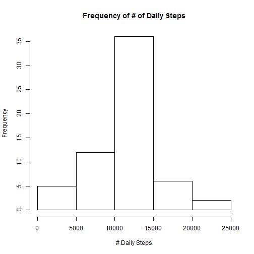
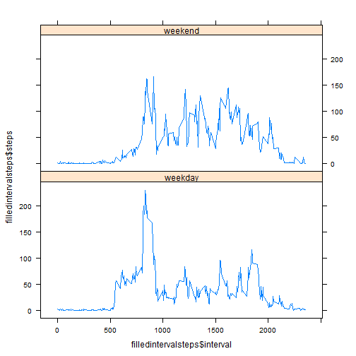

# Reproducible Research: Peer Assessment 1 - Peter Polack
 -------
## Loading and preprocessing the data

###  Read in working file, assumes working file 'activity.csv' is present in the workding directory

```r
activity <- read.csv("activity.csv")
```

     
###  Create initial dataframes
 - dailysteps - total amount of steps by day
 - intervalsteps - average amount of steps by time interval

```r
dailysteps <- aggregate(list(steps = activity$steps), by = list(date = activity$date), 
    FUN = "sum", na.rm = TRUE)
intervalsteps <- aggregate(list(steps = activity$steps), by = list(interval = activity$interval), 
    FUN = "mean", na.rm = TRUE)
```

  
 -----  
## What is mean total number of steps taken per day?
### Mean number of steps per day

```r
mean(dailysteps$steps, na.rm = TRUE)
```

```
## [1] 9354
```

### Median number of steps per day

```r
median(dailysteps$steps, na.rm = TRUE)
```

```
## [1] 10395
```

### Histogram of number of steps per day

```r
hist(dailysteps$steps, xlab = "# Daily Steps", main = "Frequency of # of Daily Steps")
```

 


 ------
## What is the average daily activity pattern?

```r
plot(intervalsteps$interval, intervalsteps$steps, type = "l", xlab = "Minute intervals", 
    ylab = "Steps (mean)")
```

 

### Which 5-minute interval, on average, contains the maximum number of steps?

```r
intervalsteps[which.max(intervalsteps[, 2]), ]
```

```
##     interval steps
## 104      835 206.2
```


 -----
## Inputing missing values

### How many NAs are in the original dataset?

```r
sapply(activity, function(x) sum(is.na(x)))
```

```
##    steps     date interval 
##     2304        0        0
```


### Create copy of original data set and fill NAs with alternative value (explained below)

Strategy for replacing NAs in the copied activity dataset  
 - Will fill copied dataset NAs with averaged interval steps figured out previously in assignment.  
 
For example: interval 0 NA would be filled with interval 0 average steps.

```r
filledactivity <- activity
filledactivity[is.na(filledactivity)] = intervalsteps$step
```


### Create new "dailyfilledsteps" aggregate, then creat new mean, median and histograme based on them
New mean and median are higher than original.  New histogram is more bell curved.
Both of these results are due to replacing the NAs with the average steps per interval.  Original values and diagram are further up in this document


```r
dailyfilledsteps <- aggregate(list(steps = filledactivity$steps), by = list(date = filledactivity$date), 
    FUN = "sum", na.rm = TRUE)
```

### Mean number of steps per day, based on updated data

```r
mean(dailyfilledsteps$steps, na.rm = TRUE)
```

```
## [1] 10766
```

### Median number of steps per day, based on updated data

```r
median(dailyfilledsteps$steps, na.rm = TRUE)
```

```
## [1] 10766
```

### Histogram of number of steps per day, based on updated data

```r
hist(dailyfilledsteps$steps, xlab = "# Daily Steps", main = "Frequency of # of Daily Steps")
```

 


 ----
## Are there differences in activity patterns between weekdays and weekends?
### Use updated copy of the original activity dataset and add weekday column that contains the day of the week for that row's date

```r
filledactivity$weekday <- weekdays(as.Date(as.character(filledactivity$date)))
```


### Add weekend column that contains "weekday"/"weekend" factor variable

```r
filledactivity$weekend <- ifelse((filledactivity$weekday == "Saturday" | filledactivity$weekday == 
    "Sunday"), "weekend", "weekday")
filledactivity$weekend <- as.factor(filledactivity$weekend)
```


### Create new aggregate of interval steps on the weekend factor column and interval

```r
filledintervalsteps <- aggregate(list(steps = filledactivity$steps), by = list(weekend = filledactivity$weekend, 
    interval = filledactivity$interval), FUN = "mean", na.rm = TRUE)
```


### Plot out interval steps by weekend and weekday
 - It seems like there was more steps in the morning on weekdays (perhaps people were getting workouts in the mornings)  
 - Step distribution was more even over the weekends, perhaps based on more general activity during a weekend


```r
library(lattice)
xyplot(filledintervalsteps$steps ~ filledintervalsteps$interval | filledintervalsteps$weekend, 
    layout = c(1, 2), type = "l")
```

 

